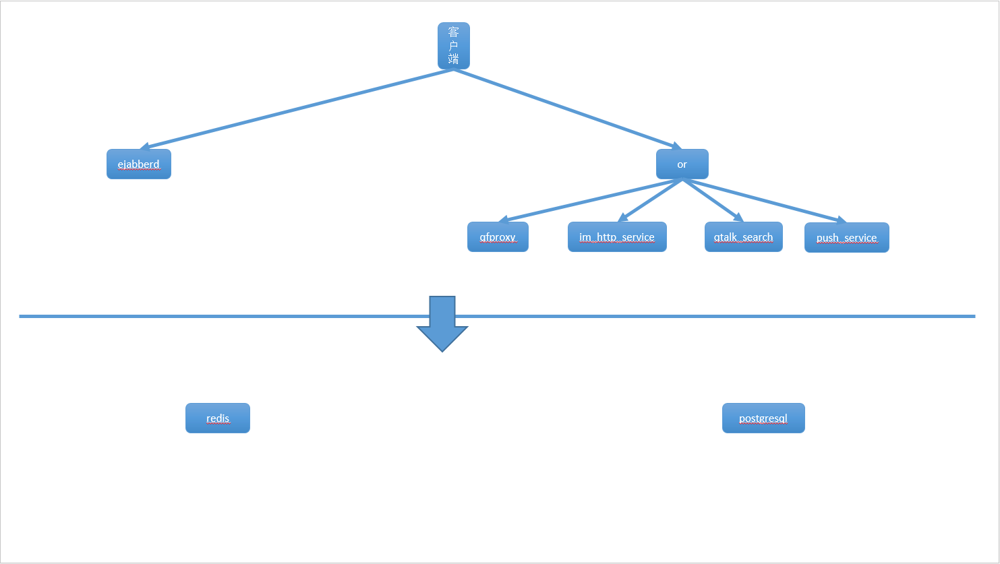

[返回首页](README.md)

# 本文简介
这篇文档改自这篇[原始文档](https://github.com/startalkIM/ejabberd/blob/master/README.md)。

源码级部署的目标，并不是提高成功率和易用性，而是帮助理解系统间的调用关系。我们希望当各组件关系很清晰了之后，再进行调整。
本文的主要目的是帮助使用者在事实上很复杂的后台部署过程中，减少出错的可能。

# 术语

本文用下面符号表示一些用户可替换的变量：

${STARTALK} 表示 Startalk 的安装路径，缺省是 `/startalk`。
${STARTALKHOST} 表示 Startalk 的主机名（域名），缺省是 `startalk.com`。

# 系统简介
通信服务就是个状态机。startalk 后台包括连接保持和无状态服务两部分。

* 状态机 使用[ejabberd](https://www.ejabberd.im/)，保证协议扩展性(MQTT,xmpp,sip)，容量扩展性和高并发。
* 无状态服务使用java/python，尽可能使二次开发更便捷。


# Startalk EJABBERD

[English Version](README.en.md)
Startalk 的消息交换服务器是基于 ejabberd 开发的，根据业务需要改造而来。修改和扩展了很多 ejaberd 不支持的功能。

## 关键功能

-   分布式：去掉了依赖 mnesia 集群的代码，来支持更大的集群，以及防止由于网络分区导致的集群状态不一致。
-   消息处理：通过 ejabberd 和 kafka 相连接，实现了消息的路由和订阅发布，可以对消息添加更丰富的处理逻辑。

## Startalk 模块
### Startalk 主要包含：

* [ejabberd](https://github.com/startalkIM/ejabberd): IM 核心组件，负责维持与客户端的长连接和消息路由
* [openresty](https://github.com/startalkIM/openresty_ng): IM 负载均衡组件，负责验证客户端身份，以及转发 http/https 请求到对应的后台服务
* [im_http_service](https://github.com/startalkIM/im_http_service): IM HTTP 接口服务，负责 IM 相关数据的查询、设置以及历史消息同步(基于 tomcat 的 java 服务)
* [qfproxy](https://github.com/startalkIM/qfproxy): IM 文件服务，负责文件的上传和下载(基于 tomcat 的 java服务)
* [push_service](https://github.com/startalkIM/push_service): IM 的 push 服务，用于离线消息的推送(基于 tomcat 的 java 服务)
* [qtalk_serach](https://github.com/startalkIM/search): 提供远程搜索人员和群的服务
* redis: IM 缓存服务
* postgresql: IM 数据库服务

### Startalk 各个模块之间的关系



## 注意事项

以下文档请务必仔细阅读和参照执行，否则可能会创建失败

强调几点：

* 切勿使用 root 账号进行如下操作，很多软件会检查当前用户名称，so 请新建用户来进行操作;
* redis 启动需要加载配置
* 对 startalk 来说，配置中的 domain 非常重要，请务必仔细配置，保持一致。
* 在开始之前请务必保证以下几个端口没有被占用：

|服务|端口|备注|
| ------------- |:-------------:| -----:|
|openresty服务|8080||
|im_http_service服务|8005 8009 8081||
|qfproxy服务|8006 8010 8082||
|push_service服务|8007 8011 8083||
|qtalk_search服务|8884||
|im服务|5202 10050 5280||
|db|5432||
|redis|6379||


## 安装

预设条件(如果主机名，用户名和这里的不一致，则需要将安装步骤中的换成自己的名字)：

* 服务器要求：centos7.x
* 主机名用变量 STARTALKHOST，可以替换成自己的主机名
* hosts 添加： 127.0.0.1 ${STARTALKHOST} (sudo vim /etc/hosts)
* 所有项目都安装到 ${STARTALK} 下面
* 安装用户和用户组是：startalk:startalk，要保证 startalk 用户有 sudo 权限
* 家目录下有 download 文件夹，所有文件会下载到该文件夹下
* 数据库用户名密码是 ejabberd:123456，服务地址是：127.0.0.1
* redis 密码是：123456，服务地址是：127.0.0.1
* 数据库初始化 sql 在 doc 目录下
* 保证可访问主机的：5202、8080 端口（关掉防火墙：`sudo systemctl stop firewalld.service`）
* IM 服务的域名是: ${STARTALKHOST} (大家安装线上之前，最好确定好这个值，一旦定了，之后修改的成本就很高，可以参考[domain 修改](https://github.com/startalkIM/ejabberd/wiki/host%E4%BF%AE%E6%94%B9)来修改)
* tls 证书：默认安装用的是一个测试证书，线上使用，请更换 /startalk/ejabberd/etc/ejabberd/server.pem 文件，生成方法见 [securing-ejabberd-with-tls-encryption](https://blog.process-one.net/securing-ejabberd-with-tls-encryption/)
* 出现文件覆盖提示时，输入 yes 敲回车即可
* 安装文档中 # 开头输入的命令表示 root 执行的，$ 开头的命令表示普通用户

### 依赖包

```
# yum -y install epel-release
# yum -y update
# yum -y groupinstall Base "Development Tools" "Perl Support"
# yum install -y telnet aspell bzip2 collectd-postgresql collectd-rrdtool collectd.x86_64 curl db4 expat.x86_64 gcc gcc-c++ gd gdbm git gmp ImageMagick java-1.8.0-openjdk java-1.8.0-openjdk-devel libcollection libedit libffi libffi-devel libicu libpcap libtidy libwebp libxml2 libXpm libxslt libyaml.x86_64 mailcap ncurses ncurses npm openssl openssl-devel pcre perl perl-Business-ISBN perl-Business-ISBN-Data perl-Collectd perl-Compress-Raw-Bzip2 perl-Compress-Raw-Zlib perl-Config-General perl-Data-Dumper perl-Digest perl-Digest-MD5 perl-Encode-Locale perl-ExtUtils-Embed perl-ExtUtils-MakeMaker perl-GD perl-HTML-Parser perl-HTML-Tagset perl-HTTP-Date perl-HTTP-Message perl-IO-Compress perl-IO-HTML perl-JSON perl-LWP-MediaTypes perl-Regexp-Common perl-Thread-Queue perl-TimeDate perl-URI python readline recode redis rrdtool rrdtool-perl sqlite systemtap-sdt.x86_64 tk xz zlib rng-tools python36-psycopg2.x86_64 python34-psycopg2.x86_64 python-psycopg2.x86_64 python-pillow python34-pip screen unixODBC unixODBC-devel pkgconfig libSM libSM-devel ncurses-devel libyaml-devel expat-devel libxml2-devel pam-devel pcre-devel gd-devel bzip2-devel zlib-devel libicu-devel libwebp-devel gmp-devel curl-devel postgresql-devel libtidy-devel libmcrypt libmcrypt readline-devel libxslt-devel vim docbook-dtds docbook-style-xslt fop
```

### 添加host

在 `/etc/hosts` 里面添加下面一行：

```
127.0.0.1 startalk.com
```
请注意如果是生产服务，可以设置自己的域名的 DNS，如果有正确 DNS 域名解析的话，这一步不是必须的。

### 新建安装用户

新增 startalk 用户：

```
# groupadd startalk
# useradd -g startalk startalk
# passwd startalk
```

新增 postgresql 数据库用户（用缺省系统包管理安装 postgresql 的用户可以忽略这一步骤）：

```
# groupadd postgres
# useradd -g postgres postgres
# passwd postgres
```

### 新建安装目录

```
# mkdir /startalk
# chown startalk:startalk /startalk
```

### 新建数据库目录

```
# mkdir /startalk/database
# chown -R postgres:postgres /startalk/database
```

### 为startalk用户添加sudo权限

```
# visudo 

在行
root    ALL= (ALL)    ALL
行后添加

startalk     ALL= (ALL)    ALL
postgres     ALL= (ALL)    ALL

保存后退出
```

### 下载源码

```
# su - startalk
$ mkdir /startalk/download
$ cd /startalk/download
$ git clone https://github.com/startalkIM/ejabberd.git
$ git clone https://github.com/startalkIM/openresty_ng.git
$ git clone https://github.com/startalkIM/search.git
$ git clone https://github.com/startalkIM/tomcat_projects.git

$ cp ejabberd/doc/qtalk.sql /startalk/
$ cp ejabberd/doc/init.sql /startalk/
```

### 检测端口使用：

```
# sudo netstat -antlp | egrep "8080|8005|8009|8081|8006|8010|8082|8007|8011|8083|8888|5202|10050|5280|6379"
```
若没有任何输出，则表明没有程序占用startalk使用的端口，否则需要关闭已经在使用端口的程序


### redis安装

```
$ sudo yum install -y redis
$ sudo vim /etc/redis.conf
将对应的配置修改为下面内容 
daemonize yes
requirepass 123456
maxmemory 134217728
 
```


### redis 启动

启动redis

```
$ sudo redis-server /etc/redis.conf
``` 

确认启动成功：

```
$ sudo netstat -antlp | grep 6379
tcp        0      0 127.0.0.1:6379          0.0.0.0:*               LISTEN      8813/redis-server 1

```

### 数据库安装

建议使用 OS 发行版对应的预编译包，比如在 CentOS 7 里，我们可以执行下面命令搜索并安装 PostgreSQL12：

>  Install the repository RPM:  
``` 
sudo yum install -y https://download.postgresql.org/pub/repos/yum/reporpms/EL-7-x86_64/pgdg-redhat-repo-latest.noarch.rpm
```

>  Install PostgreSQL:
```
 sudo yum install -y postgresql12-server
```

在 CentOS 7 里，用预编译包安装完 postgresql 之后，可执行文件在 `/usr/pgsql-12/bin` 目录下，基本所有命令无序特殊路径设置。

### 初始化数据库实例

```
sudo -u postgres /usr/pgsql-12/bin/initdb -D /startalk/database
```

### 数据库启动

```
sudo -u postgres /usr/pgsql-12/bin/pg_ctl -D /startalk/database start
```

确认启动成功
```
$ sudo netstat -antlp | grep 5432
```
输出看上去应该像下面这样：

```
tcp        0      0 127.0.0.1:5432          0.0.0.0:*               LISTEN      4751/postmaster     

```
### 初始化数据库

1. 初始化DB结构

``` 
 
$ psql -U postgres -d postgres -f /startalk/qtalk.sql
$ psql -U postgres -d ejabberd -f /startalk/init.sql
```

2. 初始化DB user: ejabberd的密码

``` 
$ psql -U postgres -d postgres -c "ALTER USER ejabberd WITH PASSWORD '123456';"
```
 
3. psql 连接数据库

```
$ psql -U postgres -d ejabberd -h 127.0.0.1
psql (12.6)

ejabberd=# select * from host_users;
```
4. 如果 ejabberd 和 postgresql 数据库不在同一服务器，则参考 postgresql 的文档修改数据库的 `pg_hba.conf` 文件允许 ejabberd 的服务器访问数据库服务器。

### openresty安装

以 CentOS 7 为例，参考[openresty 官网](http://openresty.org/en/linux-packages.html)
我们可以用包的方法快速安装 openresty：

```
wget https://openresty.org/package/centos/openresty.repo
sudo mv openresty.repo /etc/yum.repos.d/
sudo yum check-update
sudo yum install openresty
```

### openresty 启动

openresty 包安装之后位于 `/usr/local/openresty`

启动方法是：

```
sudo /usr/local/openresty/nginx/sbin/nginx
```

执行下面命令确认启动成功：

```
$ sudo netstat -antlp | grep 8080
```
输出看上去应该像下面这样：

```
tcp        0      0 0.0.0.0:8080            0.0.0.0:*               LISTEN      23438/nginx: master
```
### 为 Startalk 配置 OpenResty 

请参考[Startalk OpenResty 配置](https://github.com/startalkIM/openresty_ng/blob/master/README_CN.md) 把 Startalk 的 OpenResty 相关配置下载、配置上。
然后重启 OpenResty:

```
sudo killall nginx
sudo /usr/local/openresty/nginx/sbin/nginx 
```

### 安装 erlang

```
$ cd /startalk/download
$ wget http://erlang.org/download/otp_src_19.3.tar.gz
$ tar -zxvf otp_src_19.3.tar.gz
$ cd otp_src_19.3
$ ./configure --prefix=/startalk/erlang1903
$ make
$ make install
```

把执行路径添加到 PATH 环境变量

```
$ vim ~/.bash_profile
 
----------------------------------
# User specific environment and startup programs
ERLANGPATH=/startalk/erlang1903
PATH=$PATH:$HOME/bin:$ERLANGPATH/bin
----------------------------------
```

```
$ . ~/.bash_profile
```

执行下面命令验证 erlang 是否安装成功：

```
$ erl
```
输出看上去下面这样就是成功了：
```
Erlang/OTP 19 [erts-8.3] [source] [64-bit] [smp:4:4] [async-threads:10] [hipe] [kernel-poll:false]

Eshell V8.3  (abort with ^G)
1> 
```

### 安装ejabberd

```
$ cd /startalk/download
$ cd ejabberd/
$ ./configure --prefix=/startalk/ejabberd --with-erlang=/startalk/erlang1903 --enable-pgsql --enable-full-xml
$ make
$ make install
$ cp ejabberd.yml.qunar /startalk/ejabberd/etc/ejabberd/ejabberd.yml
$ cp ejabberdctl.cfg.qunar /startalk/ejabberd/etc/ejabberd/ejabberdctl.cfg
```
### 启动 ejabberd

```
$ cd /startalk/ejabberd
$ ./sbin/ejabberdctl start
```

验证 ejabberd 是否启动成功：
```
$ ps -ef | grep 's ejabberd'
startalk 23515     1  4 09:58 ?        00:00:03 /startalk/erlang1903/lib/erlang/erts-8.3/bin/beam.smp -K true -P 250000 -- -root /startalk/erlang1903/lib/erlang -progname erl -- -home /home/startalk -- -name ejabberd@startalk.com -noshell -noinput -noshell -noinput -mnesia dir "/startalk/ejabberd/var/lib/ejabberd" -ejabberd log_rate_limit 20000 log_rotate_size 504857600 log_rotate_count 41 log_rotate_date "$D0" -s ejabberd -smp auto start
```

### 安装java服务
> /startalk/download/tomcat_projects/ 下的是打好包的三个java服务，自己也可以使用源码打包，然后自己部署

```
$ cd /startalk/download/
$ cp -rf tomcat_projects /startalk/tomcat
$ cd /startalk/tomcat

修改推送服务的地址

$ vim /startalk/tomcat/push_service/webapps/push_service/WEB-INF/classes/app.properties
#使用星语push url, 将ip换为服务器ip
qtalk_push_url=http://ip:8091/qtapi/token/sendPush.qunar
#使用星语push key
qtalk_push_key=12342a14-e6c0-463f-90a0-92b8faec4063

修改导航地址和扩展键盘：
$  vim /startalk/tomcat/im_http_service/webapps/im_http_service/WEB-INF/classes/nav.json
$  vim /startalk/tomcat/im_http_service/webapps/im_http_service/WEB-INF/classes/androidqtalk.json
$  vim /startalk/tomcat/im_http_service/webapps/im_http_service/WEB-INF/classes/androidstartalk.json
$  vim /startalk/tomcat/im_http_service/webapps/im_http_service/WEB-INF/classes/iosqtalk.json
$  vim /startalk/tomcat/im_http_service/webapps/im_http_service/WEB-INF/classes/iosstartalk.json

将ip替换成对应机器的ip地址(sed -i "s/ip/xxx.xxx.xxx.xxx/g" 或者在vim内 :%s/ip/xxx.xxx.xxx.xxx/g)

```

### 启动java服务
```
$ cd /startalk/tomcat/im_http_service
$ ./bin/startup.sh


$ cd /startalk/tomcat/qfproxy
$ ./bin/startup.sh

$ cd /startalk/tomcat/push_service
$ ./bin/startup.sh
```


### 确认服务启动成功

```
$ sudo netstat -antlp | egrep '8081|8082|8083|8009|8010|8011|8005|8006|8007'
```
输出看上去像下面这样：

```
tcp6       0      0 127.0.0.1:8007          :::*                    LISTEN      23853/java          
tcp6       0      0 :::8009                 :::*                    LISTEN      23748/java          
tcp6       0      0 :::8010                 :::*                    LISTEN      23785/java          
tcp6       0      0 :::8011                 :::*                    LISTEN      23853/java          
tcp6       0      0 :::8081                 :::*                    LISTEN      23748/java          
tcp6       0      0 :::8082                 :::*                    LISTEN      23785/java          
tcp6       0      0 :::8083                 :::*                    LISTEN      23853/java          
tcp6       0      0 127.0.0.1:8005          :::*                    LISTEN      23748/java          
tcp6       0      0 127.0.0.1:8006          :::*                    LISTEN      23785/java 
```

### 安装后端搜索服务

#### 前提
+ openssl version >= 1.02
+ python3.7 及以上, 以3.9.2为例
```
        cd /startalk/download && wget https://www.python.org/ftp/python/3.9.2/Python-3.9.2.tgz
        tar -zxvf Python-3.9.2.tgz
        cd Python-3.9.2
        ./configure --prefix=/startalk/python392
        make && make install
```
* 添加到 `.bash_profile`
* 
```
vim ~/.bash_profile
        PYTHONPATH=/startalk/python392
        PATH=$PATH:$PYTHONPATH/bin
:wq
source ~/.bash_profile
```

* (可选) 建议使用virtualenv部署模块所需环境
> 升级pip
```
/startalk/python392/bin/python3.9 -m pip install --upgrade pip -i https://pypi.tuna.tsinghua.edu.cn/simple
```
> 下载安装virtualenv
```
pip3.9 install -U virtualenv -i https://pypi.tuna.tsinghua.edu.cn/simple 
```
> 创建虚拟环境
```
cp -rf /startalk/download/search /startalk/ && cd /startalk/search && virtualenv --system-site-packages -p python3.9 ./venv
```
> 启动环境
```
source venv/bin/activate
```

#### 安装：
* 配置conf/configure.ini
* 安装依赖,  使用-i 国内源下载项目
```
pip install -r requirements.txt -i https://pypi.tuna.tsinghua.edu.cn/simple
```
* 启动项目
```
supervisord -c /startalk/search/conf/supervisor.conf
```

#### 确认服务正常：
```
tail -100f /startalk/search/log/access.log
```
--------------------------------------------------------------------------------


可以执行以下脚本来检查一些常见的错误: 下载该文件[check.sh](https://github.com/startalkIM/openresty_ng/blob/master/tools/check.sh)

```
# sed -i 's/ip/自己的ip/g' ./check.sh
# chmod +x check.sh
# ./check.sh
```

如果发现有提示："ip的5202端口未开启外网访问，请开启该端口访问或者关掉防火墙"，请在服务器上使用telnet ip 5202检查是否可以连上，一般是因为防火墙限制了或者端口就没监听。

到此，服务端已经安装完成。
请下载[startalk客户端](https://i.startalk.im/home/#/download)

客户端配置导航地址：[http://ip:8080/newapi/nck/qtalk_nav.qunar](http://ip:8080/newapi/nck/qtalk_nav.qunar)，使用账号：admin，密码：testpassword登陆(将ip替换成自己服务器的ip)

客户端配置导航的说明[配置导航](https://im.qunar.com/#/platform/access_guide/config_navs?id=config_navs)

可以在二维码生成网站[http://www.liantu.com/](http://www.liantu.com/)生成导航地址的二维码，然后通过扫码在手机客户端添加导航

请参考wiki和接口文档进行相关了解


## 分支和PR

当前，我们项目的分支是：

* master(主干分支)
* release(用于合并到master的准发布分支)
* develop(当前开发分支)
* v1.0(1.0版本的分支)
* v1.1(1.1版本的分支，当前最新稳定分支)
* v2.0(2.0分支版本，支持Erlang/OTP 21.2)


大家提交pull request的时候，可以根据不同分支的功能，合并到不同的分支

## ejabberd 相关 wiki地址

[wiki页](https://github.com/startalkIM/ejabberd/wiki)

## ejabberd 配置文件修改

参考文档 [setting.md](https://github.com/startalkIM/ejabberd/blob/master/doc/setting.md)

## ejabberd 接口文档

参考文档 [interface.md](https://github.com/startalkIM/ejabberd/blob/master/doc/interface.md)

## 开发指南

- [developer guide](https://docs.ejabberd.im/developer/guide/)

## 日志路径

整个系统运行有如下日志可以供参考：

* postgresql 数据库日志：缺省输出到标准输出，请参考 postgresql 配置文件修改配置（缺省是 ${STARTALK}/database/postgresql.conf），将其定向到合适的路径
* redis 日志：系统安装的话缺省是：`/var/log/redis/redis.log`，若自己编译安装请自行查找位置
* ejabberd 日志：缺省是 `${STARTALK}/ejabberd/var/log/ejabberd/`
* openresty 日志：缺省是 `${STARTALK}/openresty/nginx/logs/`, 系统安装包的话，一般是在 `/usr/local/openresty/nginx/logs/`
* 几个 Java 进程日志：缺省在 `${STARTALK}/tomcat/` 里头，有一些 Java 的应用，比如最重要的是：`${STARTALK}/tomcat/im_http_service/logs/`，可以关注里面的 `catalina.out`，其它还有 `qfproxy` 和 `push_service` 对应的 log 目录。

这些日志路径里有对应的运行日志，如果启动或者其他方面的失败，可以耐心看看这些目录里头的日志文件，里面有不少很有价值的信息。


# 问题反馈

- app@startalk.im（邮件）
- 1065751631（QQ群）
- QQ群二维码 

[返回首页](README.md)
